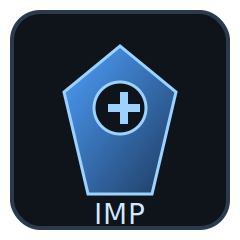
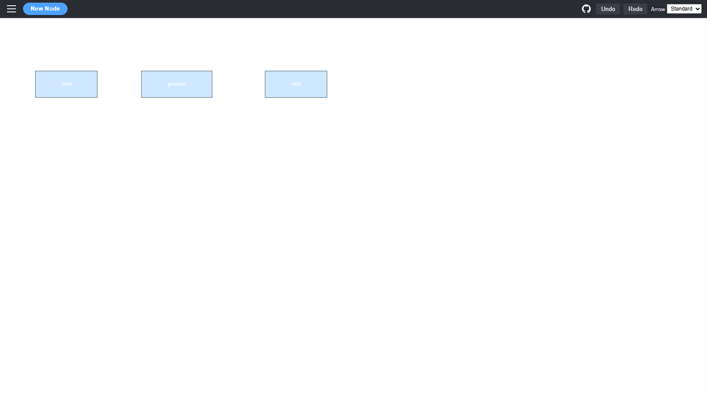
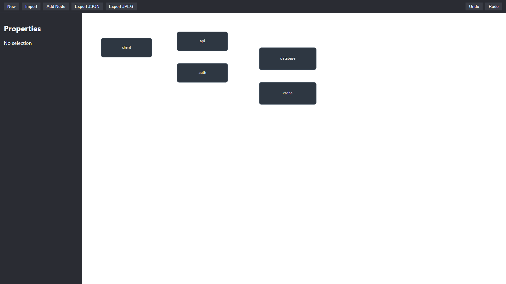
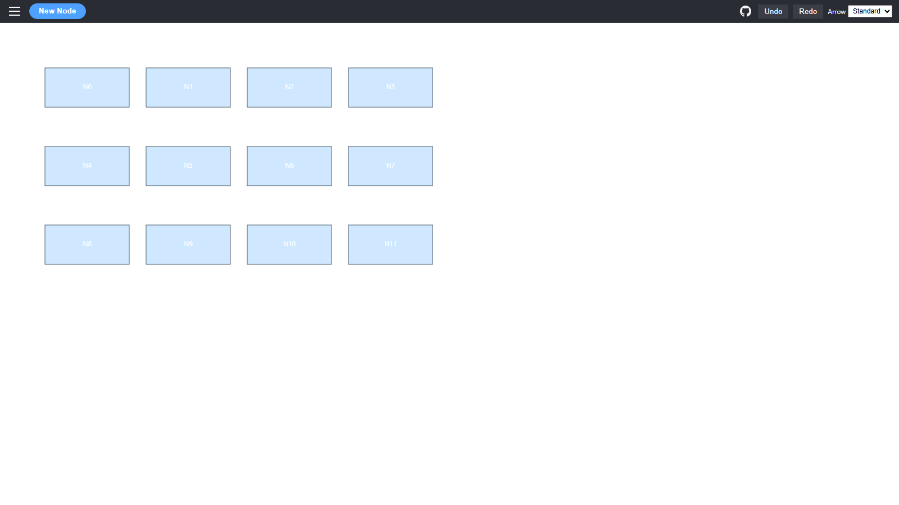
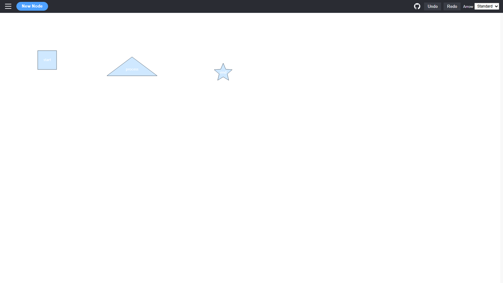
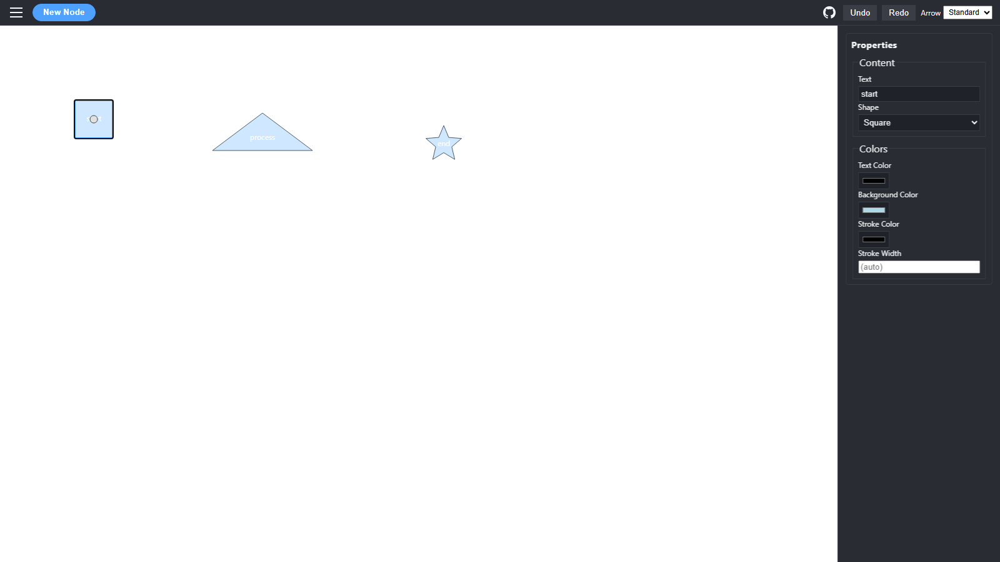
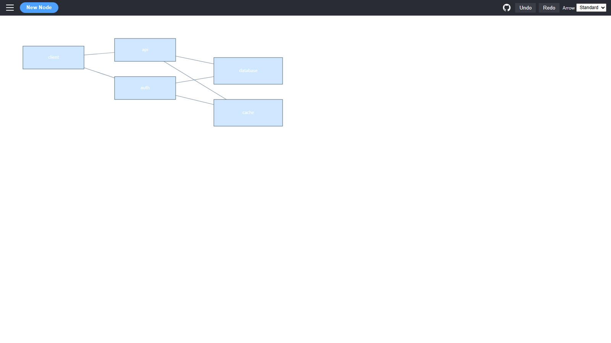

# ai-diagram-imp



AI Diagram Imp web-based diagram generator scaffold (architecture docs, React+Vite app, command pattern, testing setup).

Now supports basic drag-and-drop repositioning of nodes; updated coordinates persist in exported JSON.

Properties Sidebar: The properties panel now slides in only when a node is selected and includes a focus trap so Tab / Shift+Tab stay within the panel fields until you press Esc or click the canvas.

➡ For end-user instructions see: [User Guide](./USER_GUIDE.md)

## Example Screenshots

Captured with Playwright at a 1600x900 desktop viewport using predefined example diagrams (`?example=<key>`). See `tests/e2e/screenshots.spec.ts` and `src/model/examples.ts`.

| Basic Flow | Mini Architecture | Grid Layout |
|------------|-------------------|-------------|
|  |  |  |

### Node Variety & Property Pane

Automatically generated via `tests/e2e/readme-screenshots.spec.ts`.

| Node Shape Variety | Selected Node with Property Pane |
|--------------------|----------------------------------|
|  |  |

### Connected Examples

These variants include edges to show link rendering.

| Basic Flow (Connected) | Architecture (Connected) |
|------------------------|--------------------------|
|  |  |

Regenerate locally:

```powershell
cd app
npx playwright test tests/e2e/screenshots.spec.ts
```

Add new examples by editing `src/model/examples.ts` and re-running the screenshot test.

## Splash Screen

A lightweight splash screen (see `SplashScreen.tsx`) displays the project logo briefly during initial load. By default it only appears in production builds. Control it with an environment variable before `vite` or `npm run dev/build`:

```bash
# Force enable while developing
VITE_FORCE_SPLASH=1 npm run dev

# Force disable even in production build
VITE_FORCE_SPLASH=0 npm run build
```

Timing and logic are in `src/main.tsx`.

## Demo

Live site: [https://vincemic.github.io/ai-diagram-imp/](https://vincemic.github.io/ai-diagram-imp/)


## Deployment (GitHub Pages)

This repo contains a GitHub Actions workflow (`.github/workflows/deploy-pages.yml`) that builds the Vite app in `app/` and publishes it to GitHub Pages.

### How it works

1. On push to `main`, the workflow installs dependencies (`npm ci`) in `app/`.
2. It sets an environment variable `VITE_BASE_PATH` used by `vite.config.ts` to set the `base` option.
3. Vite builds to `app/dist` which is uploaded as a Pages artifact.
4. A deploy job publishes that artifact to GitHub Pages.

### Configuring the base path

`vite.config.ts` reads `process.env.VITE_BASE_PATH` (defaults to `/`). For user or organization Pages of form `https://<user>.github.io/<repo>/`, set `VITE_BASE_PATH` to `/<repo>/` (trailing slash required). The workflow sets a conservative default; if your repository name differs from the owner you may adjust the expression or hardcode:

```yaml
env:
  VITE_BASE_PATH: /<repo-name>/
```

### First-time setup steps

1. In the repository Settings → Pages, set Source to "GitHub Actions".
2. Push to `main` (or trigger via Actions → Run workflow) to generate the initial deployment.
3. After deploy, the workflow output will show the published URL.

### Local preview with base path

You normally run:

```bash
cd app
npm run dev
```
 
For testing a non-root base locally:

```bash
VITE_BASE_PATH=/ai-diagram-imp/ npm run dev
```
 
Then open `http://localhost:5173/ai-diagram-imp/`.

### Troubleshooting

- Missing assets (404): Ensure `base` in `vite.config.ts` matches deployment path.
- Old cache: Invalidate with a hard refresh (Ctrl+Shift+R) or bump a query parameter.
- 404 on deep links: GitHub Pages needs a redirect fallback; consider adding a `404.html` copying `index.html` for client routing (not yet necessary if only root usage).

## License

Released under the MIT License. See [`LICENSE`](./LICENSE) for full text.

